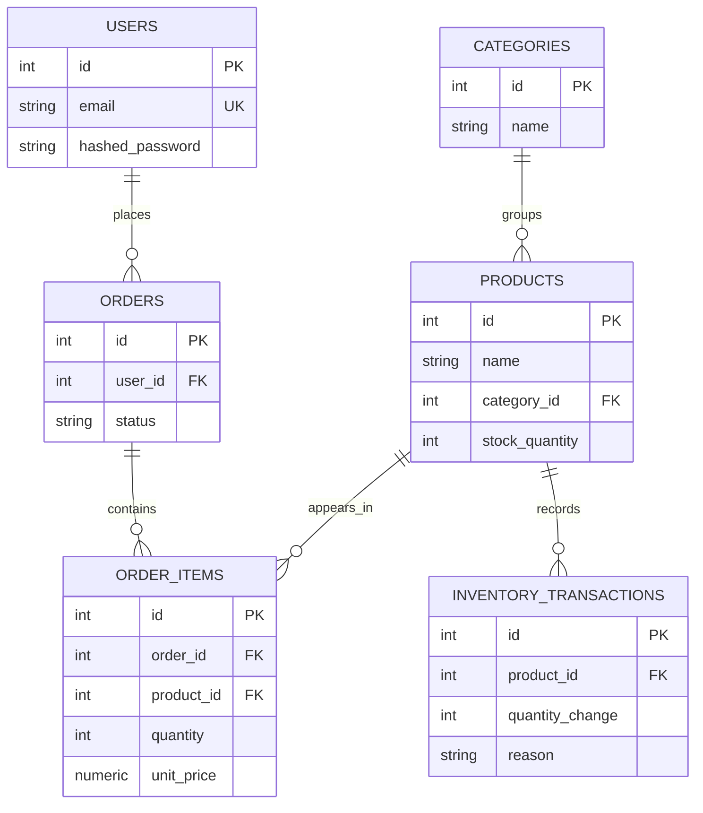

# InventoryX — Database ER Diagram

```mermaid
erDiagram
  USERS ||--o{ ORDERS : places
  CATEGORIES ||--o{ PRODUCTS : groups
  PRODUCTS ||--o{ INVENTORY_TRANSACTIONS : records
  ORDERS ||--o{ ORDER_ITEMS : contains
  PRODUCTS ||--o{ ORDER_ITEMS : appears_in
  USERS {
    int id PK
    string email UK
    string hashed_password
  }
  CATEGORIES {
    int id PK
    string name
  }
  PRODUCTS {
    int id PK
    string name
    int category_id FK
    int stock_quantity
  }
  ORDERS {
    int id PK
    int user_id FK
    string status
  }
  ORDER_ITEMS {
    int id PK
    int order_id FK
    int product_id FK
    int quantity
    numeric unit_price
  }
  INVENTORY_TRANSACTIONS {
    int id PK
    int product_id FK
    int quantity_change
    string reason
  }
```

Conceptual relationship view based on the documented domain. Verify exact column names and constraints against `app/models/` and the Alembic revisions.
